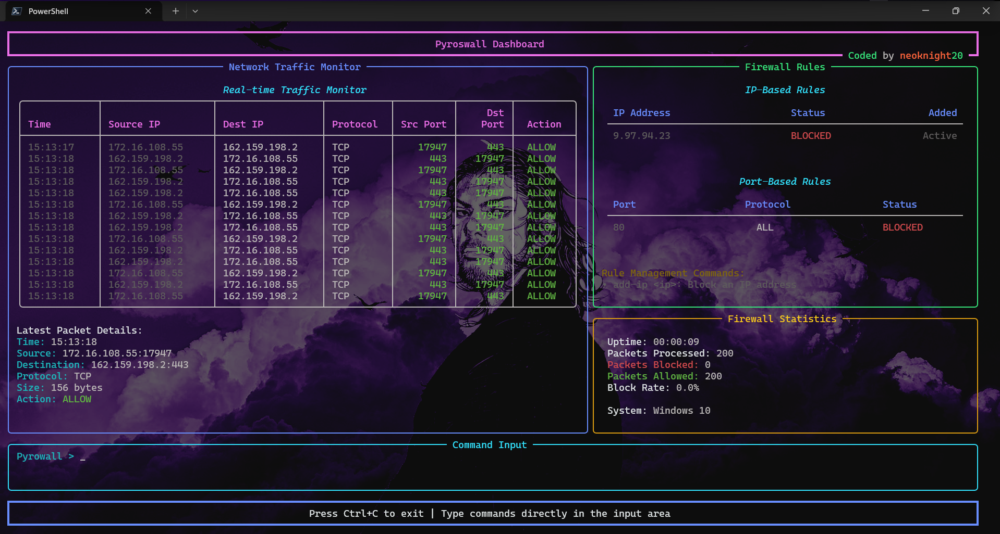

### PyFirewall

#### A simple firewall with cross platform support. with Interactive TUI



#### Features:
- Block IPs
- Block Ports


#### Requirements:
- Python 3.6+
- Windows, Linux
- Admin Privileges
- Python Libraries:
  - os
  - scapy
  - subprocess
  - platform
  - pydivert (for windows)
  - socket
  - ipaddress
  - rich


#### Installation:
- Install requirements using pip:
```bash
pip install -e .
```

- For windows you need to run the script on elevated privileges (as admin) to use the pydivert library.
- For Linux you need to run the script on elevated privileges (sudo) to use the iptables command.

```bash
python3 main.py
``` 
